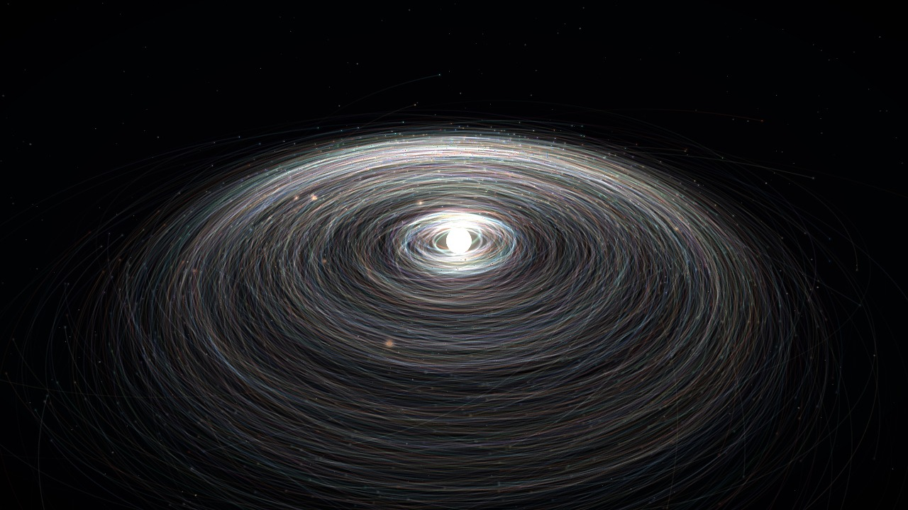
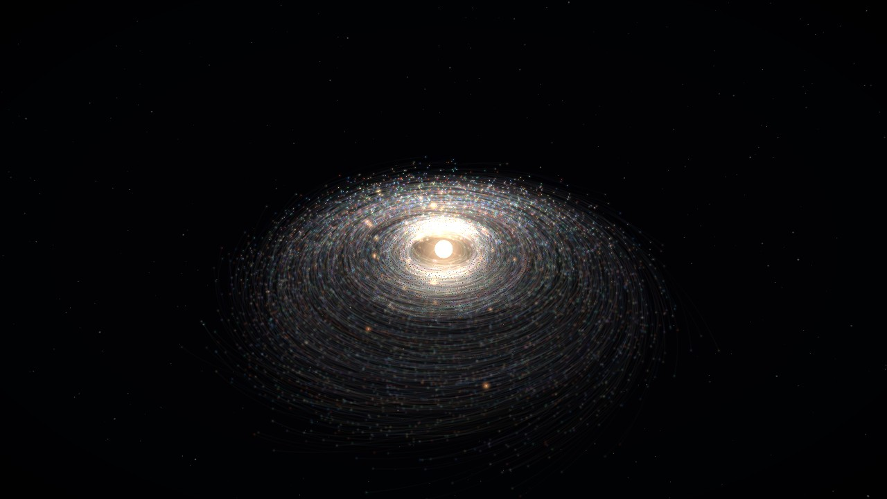
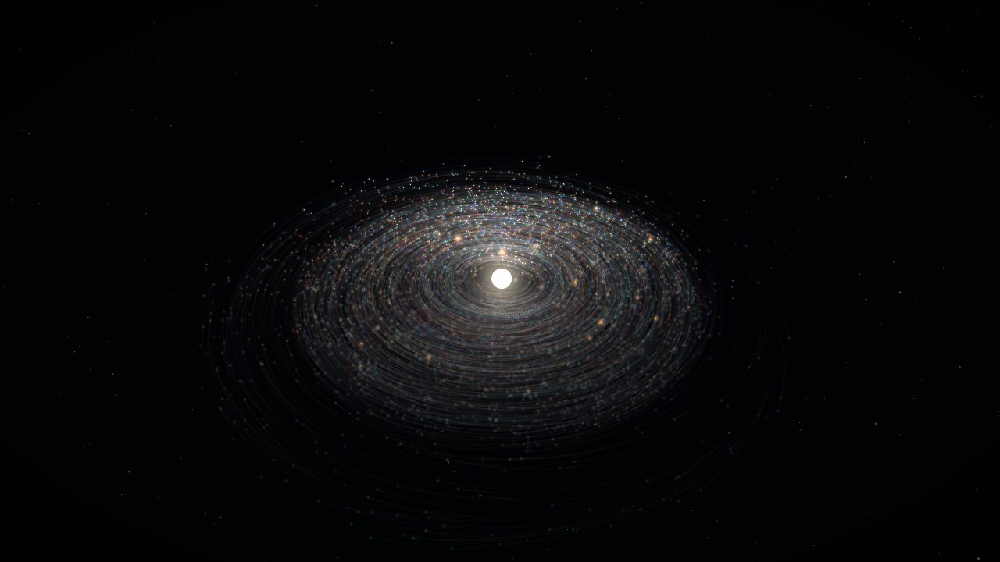
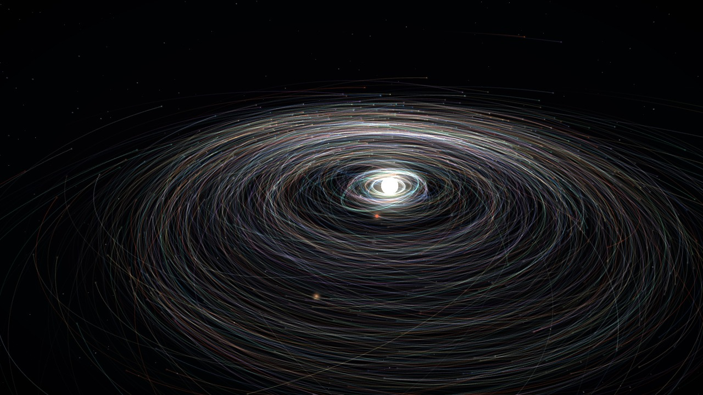
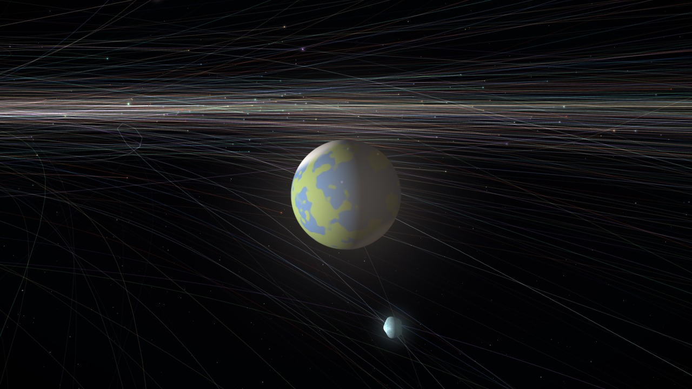
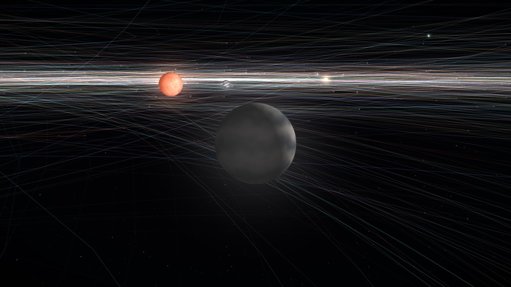
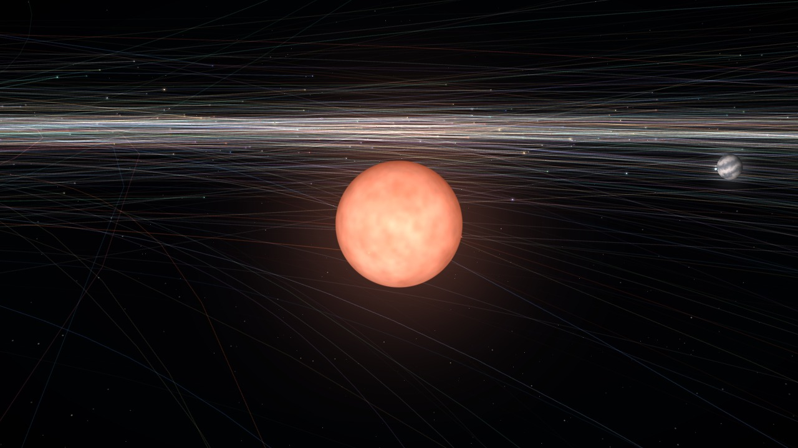

# Cosmos — GPU N-Body Gravity Simulation in WebGL2

[](https://absoyak.github.io/cosmos-demo/)


**A universe in a single HTML file.** Thousands of randomly generated planets attract each other with real
Newtonian gravity, collide, merge, and — after a few chaotic minutes — settle into a stable solar system
orbiting a star that was born from the collisions. All physics runs on the GPU.

### ▶ [Run it in your browser](https://absoyak.github.io/cosmos-demo/)

[](https://absoyak.github.io/cosmos-demo/)

No build step, no dependencies, no install: open the link above, or clone the repository and open `index.html`
in a current Chrome, Edge or Firefox.

## From chaos to a solar system

| | |
| :---: | :---: |
| [](assets/01-star-ignites.jpg) | [](assets/02-age-of-collisions.jpg) |
| **0:06** — the dense core has collapsed and the star ignites | **0:45** — *age of collisions*: a third of the planets are already gone |
| [](assets/03-equilibrium.jpg) | [](assets/04-ocean-world.jpg) |
| **5:00** — *equilibrium*: 870 survivors on stable, nearly circular orbits | Zoom in: every planet has a surface, spins, and is lit by the star |
| [](assets/05-view-from-the-disk.jpg) | [](assets/06-red-dwarf.jpg) |
| The view from inside the disk | A body that gathers 1 % of all mass ignites: here a red dwarf companion |

All images are unedited frames from one run (`?cosmos=30&seed=777`), rendered with the built-in screenshot function.

| Time (1× speed) | What happens |
| --- | --- |
| 0 – 3 s | The dense core of heavy fragments collapses and ignites as the central star. |
| 0 – 2 min | *Age of collisions.* Planets in the rotating disk sweep each other up; every merger flashes. Half of them are gone after about a minute. |
| 2 – 4 min | Collisions thin out. Around 85 % of the planets have merged; a few giants (sometimes a red dwarf companion) have emerged. |
| 4 min + | *Equilibrium.* The survivors circle the star in one plane, in the same direction, on nearly circular orbits. |

Small bodies are lumpy rocks; they round out as they gain mass. Planets come in four kinds — rocky, gas giant,
ocean and ice — and merged planets blend the colours of their parents.

## The one parameter

At the top of the script:

```js
const COSMOS = 30;   // planet count = COSMOS² × 10  →  20: 4,000 · 30: 9,000 · 40: 16,000
```

It can also be set from the URL ([`?cosmos=40&seed=7`](https://absoyak.github.io/cosmos-demo/?cosmos=40&seed=7)) or from
the box in the top-right corner. Every universe is generated from a seed, shown in the HUD, so a good one can be replayed.

## Controls

| Input | Action |
| --- | --- |
| Drag / wheel | Rotate / zoom |
| `Space` | Pause |
| `N` | New universe (new seed) |
| `T` | Orbit trails on/off |
| `F` | Follow the largest star |
| `O` | Auto-rotate camera |
| `+` / `-` | Simulation speed (0.25× – 8×) |
| `P` | Save a PNG screenshot |
| `H` | Hide the panels |

## How it works: N-body physics in fragment shaders

The whole state lives in float textures — one texel per planet — and every simulation step is two
full-screen fragment shader passes (GPGPU on plain WebGL2, no compute shaders needed):

1. **Forces (N²).** Each planet loops over every other planet, sums the gravitational acceleration, and
   checks for contact. If it touches something bigger, it records that body as its absorber.
2. **Merge + integrate.** An absorbed planet dies (mass 0). Its absorber takes over its mass, momentum,
   colour *and the force acting on it* — summing the forces makes the mutual pull between the two cancel
   exactly, so mergers conserve momentum. Then a symplectic (semi-implicit Euler) kick–drift step.

Chains (A eats B while B eats C) are resolved deterministically in parallel: a planet is only absorbed if
its absorber survives the step; otherwise it simply waits one more step.

Around that core:

- **Compaction.** Statistics are read back asynchronously (PBO + fence, no stalls). When fewer than 70 % of
  the slots are alive, the CPU builds a remap table and the GPU copies the survivors into smaller textures,
  so the N² cost drops quickly as planets merge.
- **Trails** are true world-space orbits: a ring buffer of past positions in a 2D texture array, drawn as
  instanced line strips straight from vertex texture fetches. The sample budget is fixed, so trails get
  longer as the planet count falls.
- **Rendering** uses no vertex buffers at all — quads and lines are generated from `gl_VertexID` /
  `gl_InstanceID`, and planets are shaded as sphere impostors with procedural surfaces.

### Physics notes

- The initial cloud is a rotating disk of light planets plus a compact core of a few heavy fragments that
  holds most of the mass (`CORE_MASS`). Without a dominant central mass a self-gravitating disk fragments
  into several comparable stars and never settles.
- `GAS_DRAG` models the nebular gas of a young system: a weak, slowly fading pull toward the local circular
  orbit. It damps the eccentricity that the growing giants keep stirring up. Set it to `0` for pure gravity.
- `ORBIT_SECONDS` sets how long an orbit at half the cloud radius takes on screen; the gravitational
  constant is derived from it, so the pace is the same for every `COSMOS` value.

All tuning constants are in the `CFG` block right below `COSMOS`, and any of them can be overridden from the
URL for experiments, e.g. [`?GAS_DRAG=0&CORE_MASS=0.9`](https://absoyak.github.io/cosmos-demo/?GAS_DRAG=0&CORE_MASS=0.9).

From the browser console, `cosmos.advance(1000)` fast-forwards and `cosmos.measure()` reports the
population, the largest masses and the median eccentricity / inclination of the orbits.

## Performance

Measured on an RTX 5070 Ti, time per physics step at the start (before any compaction):

| COSMOS | Planets | Pair interactions / step | ms / step |
| --- | --- | --- | --- |
| 20 | 4,000 | 16 million | 0.8 |
| 30 | 9,000 | 81 million | 1.7 |
| 40 | 16,000 | 256 million | 3.3 |
| 64 | 40,960 | 1.7 billion | 9.0 |

Requires WebGL2 with `EXT_color_buffer_float` (any desktop GPU from the last decade).

## Keywords

N-body simulation · gravity simulator · WebGL2 GPGPU · GPU physics in the browser · solar system formation ·
planetary accretion · protoplanetary disk · orbital mechanics · GLSL fragment shader compute · JavaScript · creative coding
